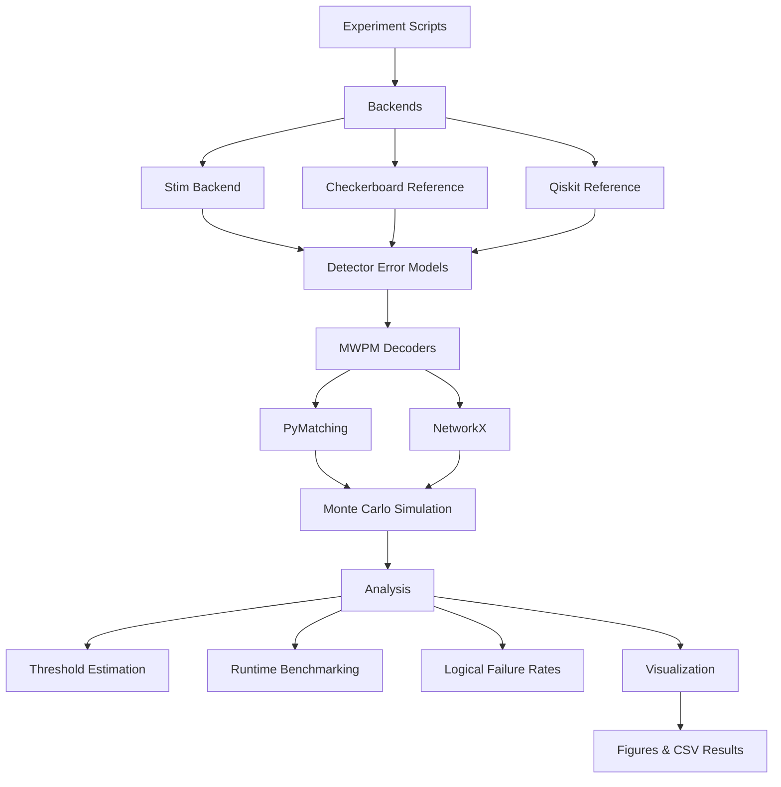

# Surface Code Benchmark Framework

A modular Python framework for benchmarking quantum error correction using surface codes.

The framework provides interchangeable simulation backends, decoding algorithms, experiment pipelines, analysis utilities, and visualization tools for studying the performance of quantum surface codes under configurable noise models.

Designed for research and education, it separates circuit generation, decoding, simulation, analysis, and visualization into reusable components that support reproducible benchmarking.

---

## Architecture

The framework follows a modular layered architecture that separates simulation, decoding, analysis, and visualization. This enables different simulation backends and decoding algorithms to share a common benchmarking workflow.



---

## Features

### Simulation

- Stim-based rotated and unrotated surface codes
- Explicit checkerboard surface-code implementation
- Reference Qiskit implementation
- Configurable odd code distances (`d = 3, 5, 7, ...`)
- Multi-round syndrome extraction
- Circuit-level depolarising and readout noise

### Decoding

- Minimum Weight Perfect Matching (MWPM)
- PyMatching decoder
- Reference NetworkX decoder
- Detector Error Model (DEM) generation

### Experiments

- Logical failure-rate estimation
- Distance-scaling experiments
- Threshold estimation
- Runtime benchmarking
- Rotated vs. unrotated comparison
- Stim vs. reference implementation comparison
- Decoder strategy comparison

### Software Engineering

- Modular backend architecture
- Reusable analysis API
- Comprehensive visualization tools
- CSV-based experiment caching
- GitHub Actions continuous integration
- 107 automated unit tests
- ~97% code coverage

---

## Installation

Clone the repository.

```bash
git clone https://github.com/AriaWu34/surface-code-benchmark-framework.git
cd surface-code-benchmark-framework
```

Create a virtual environment.

```bash
python -m venv .venv
```

Activate the environment.

**Windows**

```bash
.\.venv\Scripts\activate
```

**Linux / macOS**

```bash
source .venv/bin/activate
```

Install the framework and development dependencies.

```bash
pip install -e ".[dev]"
```

---

## Quick Start

Verify the installation.

```bash
pytest
```

Run a threshold experiment.

```bash
python experiments/stim/threshold.py
```

Run a runtime benchmark.

```bash
python experiments/stim/runtime_benchmark.py
```

Generated figures and cached CSV files are automatically written to the `results/` directory.

---

## Repository Structure

```text
src/qec/
├── backends/         Simulation backends (Stim rotated and unrotated implementations)
├── decoders/         MWPM decoders and syndrome processing
├── reference/        Educational checkerboard and Qiskit implementations
├── analysis/         Threshold estimation and experiment utilities
└── visualization/    Plotting and benchmarking utilities

experiments/          Benchmark scripts
tests/                Unit tests
results/              Generated figures and cached experiment data
docs/                 Documentation assets
```

---

## Backends

### Stim

The production backend is built on Stim's canonical surface-code circuit generators.

The Stim backend provides

- rotated surface codes
- unrotated surface codes
- detector error model generation
- PyMatching MWPM decoding
- high-performance Monte Carlo simulation

### Checkerboard

An explicit first-principles implementation of a checkerboard surface code for validation and educational purposes.

### Qiskit

A reference implementation demonstrating explicit circuit construction, configurable noise models, Aer simulation, and NetworkX-based MWPM decoding.

---

## Experiments

The framework currently provides the following benchmark suites.

| Experiment | Backend | Description |
|------------|---------|-------------|
| Distance scaling | Stim | Logical failure rate versus physical error rate for multiple code distances |
| Threshold estimation | Stim | Estimates the surface-code threshold from curve crossings |
| Runtime benchmarking | Stim | Measures simulation runtime as a function of code distance |
| Lattice comparison | Stim | Compares rotated and unrotated surface-code implementations |
| Backend comparison | Stim + Checkerboard | Compares the Stim backend against the checkerboard reference implementation |
| Decoder comparison | Qiskit | Compares single-round and space-time decoding strategies |

---

## Results

The framework includes reproducible experiments for evaluating the performance and computational characteristics of quantum surface codes. Each experiment automatically generates figures and caches numerical results as CSV files for further analysis.

### Threshold Estimation

Threshold experiments estimate the logical error threshold by identifying the crossing point of logical failure-rate curves for increasing code distances.

<p align="center">
  
</p>

---

### Distance Scaling

Distance-scaling experiments demonstrate the suppression of logical errors below the threshold by comparing logical failure rates across multiple code distances.

<p align="center">
  
</p>

---

### Runtime Benchmarking

Runtime benchmarks measure the computational cost of logical-memory simulations as a function of code distance for both rotated and unrotated Stim surface codes.

<p align="center">
  
</p>

These experiments demonstrate how the framework can be used to evaluate both the logical performance and computational efficiency of different surface-code implementations under a common benchmarking workflow.

---

### Lattice Comparison

The framework supports direct comparison of rotated and unrotated surface-code implementations under identical noise models and decoding settings.

<p align="center">
  
</p>

---

## Testing

The project is continuously tested using GitHub Actions and currently includes

- 107 automated unit tests
- ~97% code coverage

Run the complete test suite locally.

```bash
pytest
```

---

## Future Work

The modular architecture is designed to support future extensions, including

- additional decoding algorithms
- correlated and biased noise models
- circuit-level threshold studies
- additional simulation backends
