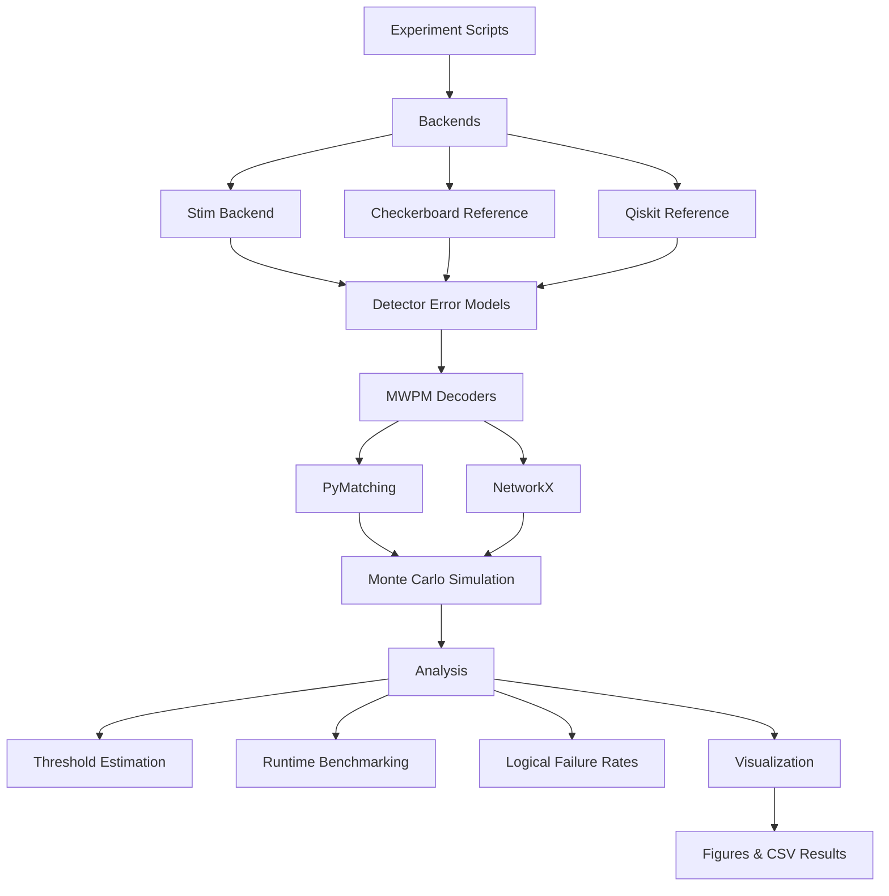
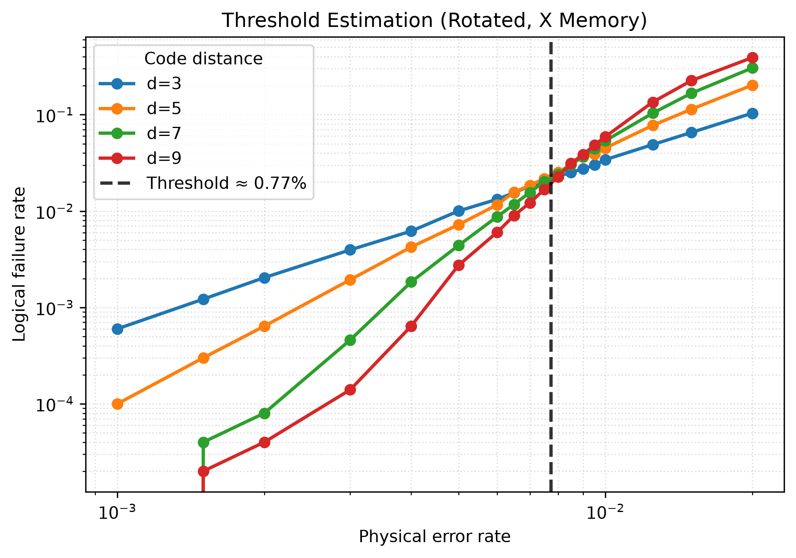
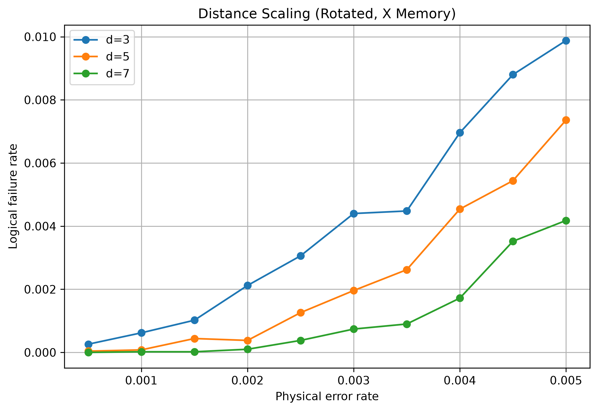
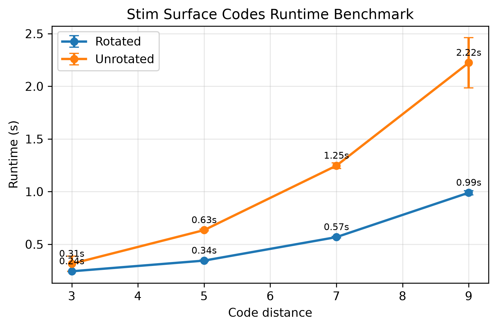
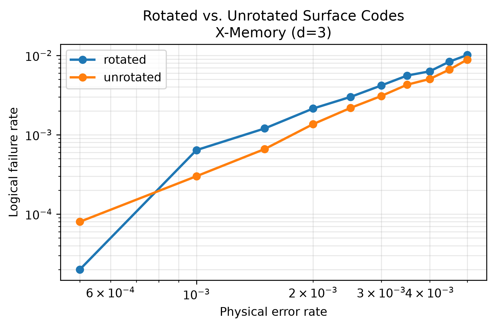

# Surface Code Benchmark Framework

[](https://www.python.org/)
[](https://github.com/AriaWu34/surface-code-benchmark-framework/actions/workflows/tests.yml)


A modular Python framework for benchmarking quantum error correction using surface codes.

The framework provides interchangeable simulation backends, decoding algorithms, experiment pipelines, analysis utilities, and visualization tools for studying the performance of quantum surface codes under configurable noise models.

Designed for research and education, it separates circuit generation, decoding, simulation, analysis, and visualization into reusable components that support reproducible benchmarking.

---

## Architecture

The framework follows a modular layered architecture that separates simulation, decoding, analysis, and visualization. This enables different simulation backends and decoding algorithms to share a common benchmarking workflow.



---

## Features

### Simulation

- Stim-based rotated and unrotated surface codes
- Explicit checkerboard surface-code implementation
- Reference Qiskit implementation
- Configurable odd code distances (`d = 3, 5, 7, ...`)
- Multi-round syndrome extraction
- Circuit-level depolarising and readout noise

### Decoding

- Minimum Weight Perfect Matching (MWPM)
- PyMatching decoder
- Reference NetworkX decoder
- Detector Error Model (DEM) generation

### Experiments

- Logical failure-rate estimation
- Distance-scaling experiments
- Threshold estimation
- Runtime benchmarking
- Rotated vs. unrotated comparison
- Stim vs. reference implementation comparison
- Decoder strategy comparison

### Software Engineering

- Modular backend architecture
- Reusable analysis API
- Comprehensive visualization tools
- CSV-based experiment caching
- GitHub Actions continuous integration
- 104 automated unit tests
- ~97% code coverage

---

## Installation

Clone the repository.

```bash
git clone https://github.com/AriaWu34/surface-code-benchmark-framework.git
cd surface-code-benchmark-framework
```

Create a virtual environment.

```bash
python -m venv .venv
```

Activate the environment.

**Windows**

```bash
.\.venv\Scripts\activate
```

**Linux / macOS**

```bash
source .venv/bin/activate
```

Install the framework and development dependencies.

```bash
pip install -e ".[dev]"
```

---

## Quick Start

Verify the installation.

```bash
pytest
```

For a guided introduction to the framework and its public API, open the interactive quick-start notebook:

```text
notebooks/quickstart.ipynb
```

The notebook demonstrates how to:

- create a simulation backend,
- estimate the logical failure rate of a surface-code memory experiment,
- understand how benchmark experiments are organised,
- inspect the generated figures and cached results.

To run the benchmark scripts directly from the command line, for example:

```bash
python experiments/stim/threshold.py
```

or

```bash
python experiments/stim/runtime_benchmark.py
```

Benchmark results are automatically written to the `results/` directory as figures (`.png`) and cached numerical data (`.csv`).

---

## Repository Structure

```text
src/qec/
├── backends/         Simulation backends (Stim rotated and unrotated implementations)
├── decoders/         MWPM decoders and syndrome processing
├── reference/        Educational checkerboard and Qiskit implementations
├── analysis/         Threshold estimation and experiment utilities
└── visualization/    Plotting and benchmarking utilities

experiments/          Benchmark scripts
tests/                Unit tests
results/              Generated figures and cached experiment data
docs/                 Documentation assets
```

---

## Backends

### Stim

The production backend is built on Stim's canonical surface-code circuit generators.

The Stim backend provides

- rotated surface codes
- unrotated surface codes
- detector error model generation
- PyMatching MWPM decoding
- high-performance Monte Carlo simulation

### Checkerboard

The checkerboard backend is an explicit first-principles implementation of a checkerboard surface-code memory experiment. Rather than relying on Stim's built-in circuit generators, it constructs the code directly from its fundamental components by explicitly defining the qubit layout, stabilizer measurements, repeated syndrome-extraction rounds, detector events, and logical observables.

This checkerboard implementation emphasizes transparency and readability over completeness and performance. It serves as an educational reference and validation backend, demonstrating the underlying principles of surface-code construction while sharing the same benchmarking interface as the Stim backend.

Because the implementation follows the standard planar checkerboard stabilizer layout, it is benchmarked against Stim's canonical unrotated surface-code implementation, which provides the closest production reference.

### Qiskit

The Qiskit backend is a lightweight reference implementation of a surface-code-inspired memory experiment using Qiskit and Aer. This implementation constructs simplified syndrome-extraction circuits with configurable depolarising and readout noise before performing MWPM decoding using the reference NetworkX decoder.

The implementation is intended for demonstration and comparison, it illustrates how quantum error-correction experiments can be expressed using the Qiskit circuit model.

---

## Experiments

The framework currently provides the following benchmark suites.

| Experiment | Backend | Description |
|------------|---------|-------------|
| Distance scaling | Stim | Logical failure rate versus physical error rate for multiple code distances |
| Threshold estimation | Stim | Estimates the surface-code threshold from curve crossings |
| Runtime benchmarking | Stim | Measures simulation runtime as a function of code distance |
| Lattice comparison | Stim | Compares rotated and unrotated surface-code implementations |
| Backend comparison | Stim (unrotated) + Checkerboard | Compares the Stim backend against the checkerboard reference implementation |
| Decoder comparison | Qiskit | Compares single-round and space-time decoding strategies |

---

## Results

The framework includes reproducible experiments for evaluating the performance and computational characteristics of quantum surface codes. Each experiment automatically generates figures and caches numerical results as CSV files for further analysis.

### Threshold Estimation

Threshold experiments estimate the logical error threshold by identifying the crossing point of logical failure-rate curves for increasing code distances.

<p align="center">
  
</p>

---

### Distance Scaling

Distance-scaling experiments demonstrate the suppression of logical errors below the threshold by comparing logical failure rates across multiple code distances.

<p align="center">
  
</p>

---

### Runtime Benchmarking

Runtime benchmarks measure the computational cost of logical-memory simulations as a function of code distance for both rotated and unrotated Stim surface codes.

<p align="center">
  
</p>

These experiments demonstrate how the framework can be used to evaluate both the logical performance and computational efficiency of different surface-code implementations under a common benchmarking workflow.

---

### Lattice Comparison

The framework supports direct comparison of rotated and unrotated surface-code implementations under identical noise models and decoding settings.

<p align="center">
  
</p>

---

## Testing

The project is continuously tested using GitHub Actions and currently includes

- 107 automated unit tests
- ~97% code coverage

Run the complete test suite locally.

```bash
pytest
```

---

## Future Work

The modular architecture is designed to support future extensions, including

- additional decoding algorithms
- correlated and biased noise models
- circuit-level threshold studies
- additional simulation backends

---

## References

This framework builds upon the following software and research:

- Craig Gidney, *Stim: A fast stabilizer circuit simulator*.
- Oscar Higgott, *PyMatching 2: Sparse Blossom for quantum error correction*.
- The Qiskit project for reference circuit construction and simulation.
- Foundational work on topological quantum error correction and surface codes, including Dennis et al. (2002) and Fowler et al. (2012).
